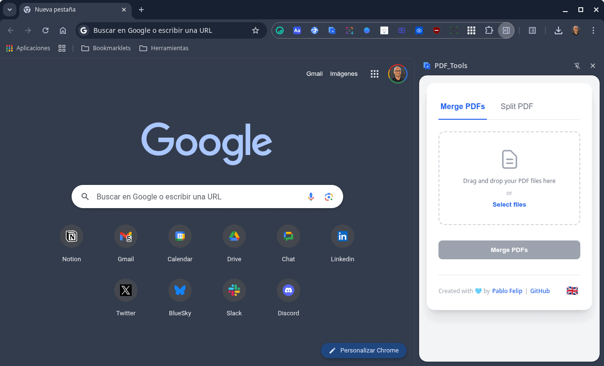

# PDF Tools for Firefox

**PDF Tools for Firefox** es una extensión ligera y potente para **Mozilla Firefox** que integra herramientas de manipulación de archivos PDF directamente en tu navegador. Une y divide documentos PDF con facilidad, sin necesidad de instalar software pesado ni depender de servicios en línea.

Esta extensión nace de la necesidad de tener a mano herramientas rápidas y eficientes para las tareas más comunes con archivos PDF. En lugar de abrir aplicaciones de escritorio o subir archivos sensibles a la web, PDF Tools procesa todo localmente en tu navegador, garantizando velocidad y privacidad.

## ✨ Características Principales

<p align="center">
  
</p>

* **Panel lateral integrado**: Accede a todas las herramientas desde un cómodo panel lateral que se mantiene abierto para operaciones drag & drop
* **Unir PDF**: Combina múltiples archivos PDF en un único documento.
    * **Arrastrar y soltar**: Añade archivos fácilmente arrastrándolos a la interfaz.
    * **Reordenación visual**: Cambia el orden de los archivos antes de unirlos simplemente arrastrándolos en la lista.
* **Dividir PDF**: Extrae páginas o rangos de un PDF.
    * **Extracción flexible**: Define rangos (`1-5, 8, 10-`) o extrae páginas individuales.
    * **División completa**: Genera un PDF por cada página del documento original con un solo clic.
* **Compresión en ZIP**: Descarga todos los archivos generados en la división dentro de un único archivo `.zip` para mayor comodidad.
* **Multi-idioma**: Interfaz disponible en inglés, español y catalán, con un selector para cambiar de idioma manualmente o usar el del navegador.
* **Procesamiento local**: Todos los archivos se procesan en tu máquina. Ningún documento sale de tu navegador, garantizando el 100% de privacidad.

## ⚙️ Descripción Técnica

PDF Tools for Firefox está construido específicamente para Mozilla Firefox usando tecnologías web estándar.

* **Firefox optimizado**: 
  - **Manifest V2**: Compatible con Firefox
  - **Sidebar Action API**: Panel lateral integrado nativo
  - **Background Script**: Gestión eficiente del sidebar
* **JavaScript (vanilla JS)**: Toda la lógica de la aplicación está escrita en JavaScript puro, sin dependencias de frameworks, lo que asegura un rendimiento óptimo y un tamaño de paquete reducido.
* **APIs de extensiones**: Utiliza las APIs estándar de WebExtensions para funcionalidades como internacionalización y almacenamiento local.
* **Procesamiento local**: Todo el procesamiento de PDFs se realiza en el navegador usando PDF-lib, garantizando privacidad completa.

## 🚀 Instalación

### Desde Mozilla Add-ons (próximamente)

_La extensión estará disponible en Mozilla Add-ons una vez completado el proceso de revisión._

### Instalación manual desde código fuente

1.  Clona este repositorio:
    ```bash
    git clone https://github.com/jjdeharo/pdf-tools-for-firefox
    cd pdf-tools-for-firefox
    ```

2.  Construye la extensión:
    ```bash
    ./build.sh
    ```

3.  Instala en Firefox:
    - Abre Firefox y ve a `about:debugging`
    - Haz clic en **"Este Firefox"**
    - Haz clic en **"Cargar complemento temporal"**
    - Selecciona el archivo `build/manifest.json`

4.  **¡Listo!** El sidebar se abrirá automáticamente.

### Uso de la extensión

**Acceso al sidebar:**
- Se abre automáticamente tras la instalación
- Usa el icono de la extensión para toggle del sidebar  
- También accesible desde: `Ver > Barra lateral > PDF Tools for Firefox`
- **Perfecto para drag & drop**: El sidebar permanece abierto durante las operaciones

> **Nota**: En Firefox, las extensiones temporales se desinstalan al cerrar el navegador. Para una instalación permanente, la extensión debe estar firmada por Mozilla.

## 🎓 Uso Educativo

Esta extensión es especialmente útil en entornos educativos donde estudiantes y profesores necesitan:
- **Combinar documentos**: Unir múltiples PDFs de tareas, apuntes o recursos
- **Extraer contenido**: Dividir documentos largos en secciones específicas  
- **Privacidad garantizada**: Todo el procesamiento es local, ideal para documentos sensibles
- **Sin instalaciones**: Funciona directamente en el navegador

Para despliegue en aulas donde los ordenadores naveguen en modo incógnito por defecto, tras instalar la extensión marca la opción **"Permitir en incógnito"** en los ajustes para que permanezca activa.

## 💙 Créditos

Este proyecto ha sido creado y es mantenido por **[Pablo Felip](https://www.linkedin.com/in/pfelipm/)**.

### Modificaciones para Firefox
Esta versión incluye adaptaciones para compatibilidad con Mozilla Firefox realizadas por **[Juan José de Haro](https://bilateria.org)** como parte de la comunidad **[Vibe Coding Educativo](https://vibe-coding-educativo.github.io/)**:
- Adaptación completa para Mozilla Firefox
- Implementación de Sidebar Action API para Firefox
- Sistema de construcción automatizada
- Interfaz optimizada para drag & drop
- Footer genérico apropiado para proyecto independiente

Este proyecto no sería posible sin el excelente trabajo de la comunidad de código abierto. Las siguientes bibliotecas se utilizan en esta extensión:

* **[pdf-lib.js](https://github.com/Hopding/pdf-lib)**: Para la creación y manipulación de documentos PDF en JavaScript.
* **[Sortable.js](https://github.com/SortableJS/Sortable)**: Para la reordenación mediante arrastrar y soltar en la lista de archivos.
* **[JSZip](https://github.com/Stuk/jszip)**: Para la creación de archivos `.zip` en el navegador.

## ✊ Licencia

Este proyecto se distribuye bajo los términos del archivo [LICENSE](/LICENSE).